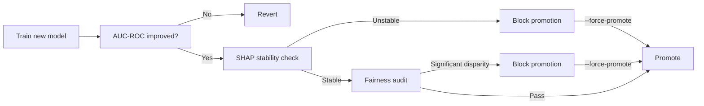

# Fairness and Bias Audit Framework

## Motivation

LedgerLens scores pseudonymous blockchain wallets with no demographic
attributes, so classic protected-class fairness metrics don't directly apply.
However, **proxy-cohort fairness** still matters: does the ensemble
systematically over-flag low-volume/new wallets (cold-start bias) or under-flag
high-volume "whale" wallets because SMOTE-balanced training data
under-represents them?

The fairness audit framework addresses this by computing standard
group-fairness metrics across on-chain proxy cohorts, gated into the
`cli.py retrain-check` promotion path alongside the existing AUC-ROC and
SHAP-stability checks.

## Design Constraint: Pseudonymity

Blockchain wallets are pseudonymous by design, and LedgerLens **must not**
attempt to infer real-world demographic attributes. Therefore:

- **Proxy cohorts only**: Cohorts are derived strictly from existing
  on-chain-observable features already computed by
  `detection/feature_engineering.py`. No new data collection, no identity
  resolution, no IP/geolocation.
- **No deanonymisation**: The `GET /admin/fairness-reports` endpoint returns
  only aggregate cohort-level rates, never per-wallet cohort assignments.
- **Safe proxies**: Geography-by-anchor-node and other deanonymisation-risk
  proxies are explicitly out of scope for v1.

## Proxy Cohorts

Cohorts are defined using three features already present in the
`WALLET_GRAPH_FEATURE_NAMES` group of `FEATURE_NAMES`:

### Volume Tier

| Bin | Label | Description |
|---|---|---|
| `[0, 1_000)` | micro | Minimal trading volume |
| `[1_000, 10_000)` | retail | Typical retail trader |
| `[10_000, 100_000)` | active | Active market participant |
| `[100_000, ∞)` | whale | High-volume trader |

### Account Age Tier

| Bin | Label | Description |
|---|---|---|
| `[0, 7)` days | new | Brand-new wallet (< 1 week) |
| `[7, 30)` days | recent | Recent wallet (< 1 month) |
| `[30, 180)` days | established | Established wallet (< 6 months) |
| `[180, ∞)` days | veteran | Long-standing wallet |

### Centrality Tier

| Bin | Label | Description |
|---|---|---|
| `[0.0, 0.25)` | isolated | Poorly connected |
| `[0.25, 0.50)` | peripheral | Moderately connected |
| `[0.50, 0.75)` | connected | Well-connected market participant |
| `[0.75, 1.0]` | hub | Highly central node |

## Metrics

### Demographic Parity Gap

The difference in **positive-flag rate** (score ≥ `RISK_SCORE_THRESHOLD`)
between the highest- and lowest-flagged cohort, per cohort dimension.

```
demographic_parity_gap = max(cohort_flag_rate) - min(cohort_flag_rate)
```

### Equalised Odds Gap

The difference in **true-positive rate (TPR)** and **false-positive rate (FPR)**
across cohorts, computed against the labelled evaluation set.

```
equalized_odds_tpr_gap = max(cohort_TPR) - min(cohort_TPR)
equalized_odds_fpr_gap = max(cohort_FPR) - min(cohort_FPR)
```

### Cold-Start Bias Check

Specifically tests whether the flag rate for wallets below an `account_age`
threshold (default: 7 days) is disproportionately high relative to the
population base rate.

```
cold_start_gap = flag_rate_young - flag_rate_mature
```

## Configuration

All settings are in `.env.example` and controlled via `config/settings.py`:

| Variable | Default | Description |
|---|---|---|
| `FAIRNESS_AUDIT_ENABLED` | `true` | Enable/disable the audit gate |
| `FAIRNESS_DISPARITY_THRESHOLD` | `0.15` | Max gap in flag rate/TPR/FPR between cohorts |
| `FAIRNESS_COLD_START_AGE_DAYS` | `7` | Age below which a wallet is "cold-start" |
| `FAIRNESS_BLOCK_PROMOTION` | `true` | Block model promotion on significant disparity |

## Promotion Gating

The fairness audit runs as the **third promotion gate** in
`cli.py retrain-check`, after AUC-ROC comparison and SHAP-stability:



When `FAIRNESS_BLOCK_PROMOTION=true` and the audit detects significant
disparity, promotion is blocked unless `--force-promote` is passed.
Overriding a fairness failure is logged at `WARNING` with the specific
disparity that was overridden, providing an audit trail.

## API

### `GET /v1/admin/fairness-reports`

Requires `X-LedgerLens-Admin-Key` header (same as `/admin/drift-reports`).

Returns the most recent fairness audit reports, each containing:

```json
{
  "id": 1,
  "model_name": "ensemble",
  "model_version": "new",
  "significant_disparity": false,
  "findings": [
    {
      "dimension": "account_age_tier",
      "metric": "demographic_parity",
      "cohort_rates": {
        "new": 0.12,
        "recent": 0.08,
        "established": 0.07,
        "veteran": 0.05
      },
      "gap": 0.07,
      "threshold": 0.15,
      "flagged": false
    }
  ],
  "computed_at": "2026-07-27T10:00:00+00:00"
}
```

## Security Considerations

- **No per-wallet data**: The API response contains only aggregate
  cohort-level rates. Per-wallet cohort assignments are never exposed.
- **Admin-key gated**: The endpoint requires `LEDGERLENS_ADMIN_API_KEY`.
- **No new deanonymisation vectors**: Cohort assignment uses only on-chain
  features already computed by the feature engineering pipeline.

## Running the Audit

The audit runs automatically as part of `cli.py retrain-check`. To run it
standalone for investigation:

```python
from detection.fairness_audit import run_fairness_audit
import pandas as pd
import numpy as np

# feature_df must contain account_age_days, network_centrality, and a volume column
report = run_fairness_audit(
    scores=model_scores,
    y_true=ground_truth_labels,  # optional, can be None
    feature_df=feature_df,
    model_name="ensemble",
    model_version="v2",
)
print(report.to_dict())
```
