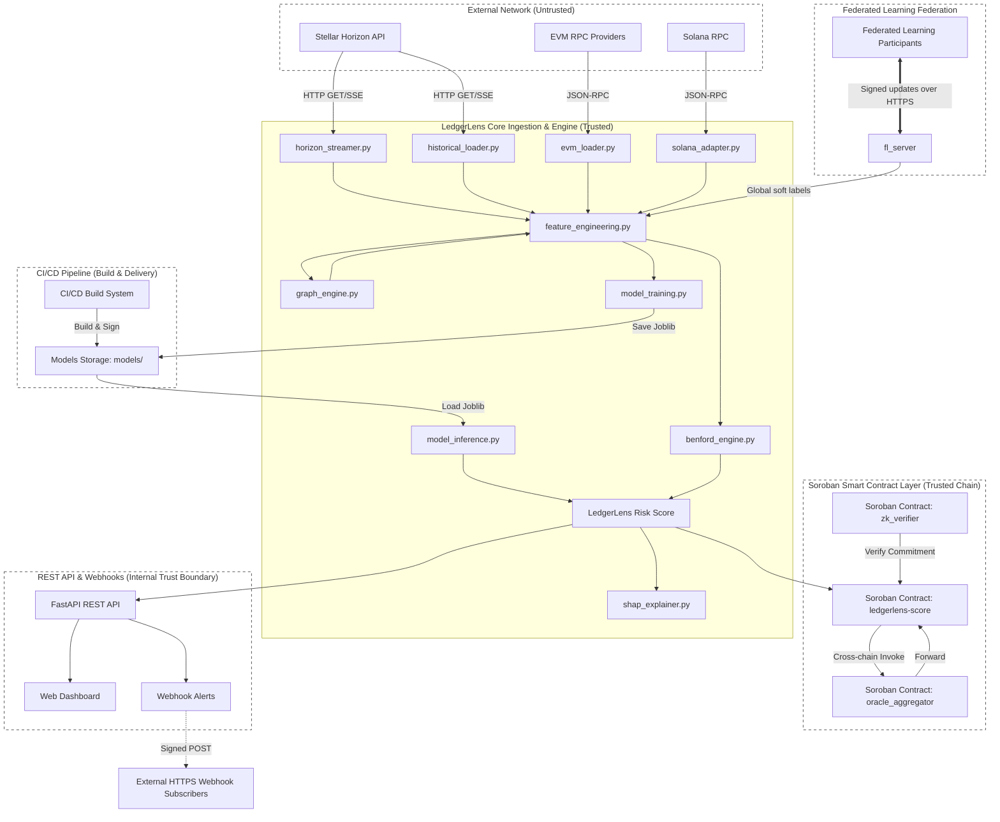

# LedgerLens Threat Model (STRIDE)

This document systematically outlines the security properties, trust boundaries, and attack surface of LedgerLens. It details the threat catalogue mapped against the STRIDE (Spoofing, Tampering, Repudiation, Information Disclosure, Denial of Service, Elevation of Privilege) methodology and records current mitigations, residual risks, and recommended improvements.

---

## Trust Boundaries

LedgerLens establishes and maintains six key trust boundaries, separating internal data processing and smart contract actions from untrusted networks and third-party interactions:

1. **External Data Sources**: The network boundary separating LedgerLens from public RPC endpoints and APIs (Stellar Horizon API, EVM RPC endpoints, and Solana RPC nodes).
2. **Webhook Subscribers**: The boundary separating the LedgerLens internal event worker from external HTTPS endpoints registered by users/subscribers to receive risk alerts.
3. **Soroban Chain**: The boundary between the off-chain pipeline (`SorobanPublisher`, `OracleCoordinator`) and the on-chain Soroban smart contracts (`ledgerlens-score` and `oracle_aggregator`).
4. **Admin API Callers**: The operational boundary restricting access to administration endpoints, metrics scoring, and model governance configurations.
5. **Federated Learning Participants**: The boundary separating the federated aggregation server from external participant nodes submitting model updates.
6. **CI/CD and Model Training Pipeline**: The supply chain boundary covering training data, dependency sources, and model parameters.

---

## Data Flow Diagram

---

## Per-Boundary STRIDE Analysis

### Boundary 1: External Data Sources

This boundary ingests trade logs, blocks, and cross-chain transfer details from external Stellar, EVM, and Solana nodes.

| Threat (STRIDE) | Scenario | Current Mitigation | Code Reference | Residual Risk | Recommended Mitigation |
|---|---|---|---|---|---|
| **S**poofing | A malicious EVM/Stellar RPC endpoint returns falsified transaction history or mock block lag data to bypass or deceive fraud markers. | Multi-provider fallback and block lag scoring to select the healthiest endpoint. | [ingestion/evm_loader.py](file:///c:/Users/HP/Ledgerlens-core/ingestion/evm_loader.py#L275-L280) (`EVMProviderPool.call`) | Medium — A single lagging or colluding provider could skew individual queries if it remains within acceptable lag limits. | Cross-validate critical block data queries against $\ge 2$ independent providers. |
| **T**ampering | A rogue node intercepts connections and tampers with Stellar Horizon payloads or Solana VAA records. | Schema validation guards; Wormhole VAA parsing decodes structural CRC checksums. | [ingestion/solana_adapter.py](file:///c:/Users/HP/Ledgerlens-core/ingestion/solana_adapter.py#L248-L260) (`_extract_stellar_address_from_vaa`), [config/settings.py](file:///c:/Users/HP/Ledgerlens-core/config/settings.py#L57-L61) (`horizon_min_version`) | Low | Enforce strict certificate pinning for all RPC connections. |
| **R**epudiation | Ingested malicious logs cannot be traced to their provider endpoint, complicating forensic review. | Ingestion logger records provider names and chain IDs for every failed query or connection drop. | [ingestion/evm_loader.py](file:///c:/Users/HP/Ledgerlens-core/ingestion/evm_loader.py#L240-L245) (`EVMProviderPoolExhaustedError`) | Low | None. |
| **I**nformation Disclosure | Plaintext transmission of RPC endpoints exposes private endpoints or embedded API keys (e.g. Infura credentials). | Configuration schema enforces HTTPS. URLs are systematically masked before printing to log files or standard outputs. | [ingestion/evm_loader.py](file:///c:/Users/HP/Ledgerlens-core/ingestion/evm_loader.py#L47-L78) (`_mask_rpc_url`, `_validate_rpc_url`) | Low | None. |
| **D**enial of Service | A failing or compromised RPC node triggers connection timeouts or a flurry of retry cycles, stalling ingestion. | Per-network circuit breakers isolate failures, and an outbound token-bucket rate limiter prevents accidental endpoint DoS. | [ingestion/evm_loader.py](file:///c:/Users/HP/Ledgerlens-core/ingestion/evm_loader.py#L701-L772) (`_TokenBucket`, `_CircuitBreaker`) | Low | None. |
| **E**levation of Privilege | An attacker passes malformed JSON-RPC payloads containing administrative commands or script blocks to downstream libraries. | Deep validation (max depth = 3) of method parameter types to prevent injection of unexpected parameters or payloads. | [ingestion/evm_loader.py](file:///c:/Users/HP/Ledgerlens-core/ingestion/evm_loader.py#L81-L111) (`_validate_rpc_params`) | Low | None. |

---

### Boundary 2: Webhook Subscribers

This boundary transmits real-time alerts and risk scores to user-defined webhook endpoints.

| Threat (STRIDE) | Scenario | Current Mitigation | Code Reference | Residual Risk | Recommended Mitigation |
|---|---|---|---|---|---|
| **S**poofing | An attacker intercepts and replays a historical signed webhook payload to trigger outdated panic rules on a subscriber. | Replay window check: alerts include a Unix epoch timestamp, and receivers are instructed to reject payloads older than 5 minutes. | [docs/webhook_security_model.md](file:///c:/Users/HP/Ledgerlens-core/docs/webhook_security_model.md#L30-L44) | Low — Depends on whether the subscriber implements the timestamp validation. | Provide a standard SDK middleware for webhook verification that enforces this by default. |
| **T**ampering | An attacker intercepts and alters a webhook payload, modifying scores or flags. | The entire raw request body is signed using HMAC-SHA256 with the subscriber's registered secret key. | [docs/webhook_security_model.md](file:///c:/Users/HP/Ledgerlens-core/docs/webhook_security_model.md#L5-L29) | Low | None. |
| **R**epudiation | A subscriber claims they did not receive a critical alert. | The webhook dispatcher retry scheme attempts delivery up to 8 times with exponential backoff before routing to a dead-letter queue (DLQ). | [docs/webhook_security_model.md](file:///c:/Users/HP/Ledgerlens-core/docs/webhook_security_model.md#L55-L64) | Low | Maintain immutable audit logs for webhook deliveries. |
| **I**nformation Disclosure | Webhook payloads containing sensitive transaction metadata leak via worker logs. | Webhook worker and database logs strip wallet addresses and transaction hashes. | [tests/test_log_no_wallet_addresses.py](file:///c:/Users/HP/Ledgerlens-core/tests/test_log_no_wallet_addresses.py) | Low | None. |
| **D**enial of Service | An attacker registers a slow webhook endpoint to exhaust delivery threads and block the dispatch queue. | Deliveries use isolated worker threads with strict timeouts and concurrent worker pools. | [docs/webhook_security_model.md](file:///c:/Users/HP/Ledgerlens-core/docs/webhook_security_model.md#L90) (`TestConcurrency`) | Low | None. |
| **E**levation of Privilege (SSRF) | A malicious subscriber registers a loopback or private IP range (e.g. `127.0.0.1`, RFC 1918) to access internal APIs via the worker. | SSRF protection layer resolves URLs via DNS and rejects private or reserved IP ranges. | [docs/webhook_security_model.md](file:///c:/Users/HP/Ledgerlens-core/docs/webhook_security_model.md#L65-L78), [detection/webhook_registry.py](file:///c:/Users/HP/Ledgerlens-core/detection/webhook_registry.py) | Low | None. |

---

### Boundary 3: Soroban Chain

This boundary anchors wash-trading risk scores to the Soroban smart contract layer.

| Threat (STRIDE) | Scenario | Current Mitigation | Code Reference | Residual Risk | Recommended Mitigation |
|---|---|---|---|---|---|
| **S**poofing | A single compromised oracle node publishes fabricated scores to malicious addresses. | 3-of-5 multi-signature oracle quorum. On-chain contracts verify each signature against a public key whitelist. | [contracts/oracle_aggregator/src/lib.rs](file:///c:/Users/HP/Ledgerlens-core/contracts/oracle_aggregator/src/lib.rs#L26-L56) (`submit_with_quorum`), [docs/oracle_quorum.md](file:///c:/Users/HP/Ledgerlens-core/docs/oracle_quorum.md) | Medium — Keys are held in env variables on nodes, vulnerable to host compromise. | Integrate Hardware Security Modules (HSMs) or Threshold BLS schemes (scoped under a separate open issue). |
| **T**ampering | An attacker intercepting an oracle submission tampers with the score payload. | Smart contract validates the canonical SHA-256 message structure and signature. | [contracts/oracle_aggregator/src/lib.rs](file:///c:/Users/HP/Ledgerlens-core/contracts/oracle_aggregator/src/lib.rs#L68-L94) (`canonical_message`) | Low | None. |
| **R**epudiation | An oracle node denies publishing a fraudulent or incorrect score. | Every submission contains a unique signature pair matching the signing node's public key. | [contracts/oracle_aggregator/src/lib.rs](file:///c:/Users/HP/Ledgerlens-core/contracts/oracle_aggregator/src/lib.rs#L44-L52) | Low | None. |
| **I**nformation Disclosure | The publisher leaks `LEDGERLENS_SERVICE_SECRET_KEY` during error handling or serialization. | The publisher zeroes key strings in memory, overrides `__getstate__` to block serialization, and masks logs. | [detection/soroban_publisher.py](file:///c:/Users/HP/Ledgerlens-core/detection/soroban_publisher.py), [docs/oracle_quorum.md](file:///c:/Users/HP/Ledgerlens-core/docs/oracle_quorum.md#L19-L22) | Low | None. |
| **D**enial of Service | Soroban RPC connection failures freeze the scoring pipeline due to submission retry loops. | A publisher-specific circuit breaker isolates Soroban execution failures and resets after 5 minutes. | [detection/soroban_publisher.py](file:///c:/Users/HP/Ledgerlens-core/detection/soroban_publisher.py) (`SorobanCircuitOpenError`) | Low | None. |
| **E**levation of Privilege | An unprivileged caller submits scores directly to `ledgerlens-score`. | Only calls routed through the authorized `oracle_aggregator` with a valid threshold quorum are accepted. | [contracts/oracle_aggregator/src/lib.rs](file:///c:/Users/HP/Ledgerlens-core/contracts/oracle_aggregator/src/lib.rs#L58-L64) | Low | None. |

---

### Boundary 4: Admin API Callers

This boundary regulates operational controls over retraining, causal inference, GNN parameters, and metrics.

| Threat (STRIDE) | Scenario | Current Mitigation | Code Reference | Residual Risk | Recommended Mitigation |
|---|---|---|---|---|---|
| **S**poofing | An attacker guesses or obtains the admin API key and triggers model updates or disables features. | Key verification requires a headers-based key match checked with timing-safe comparison. | [api/auth.py](file:///c:/Users/HP/Ledgerlens-core/api/auth.py#L32-L49) (`require_admin_key`) | Medium — Key is a static secret configured via environment variables. | Move to the scoped per-key API auth model introduced in `#195` with role boundaries. |
| **T**ampering | An attacker modifies governance parameters or disables key checks dynamically. | Settings reloader enforces a strict whitelist excluding secret keys (`ledgerlens_admin_api_key`, `ledgerlens_service_secret_key`). | [docs/governance_protocol.md](file:///c:/Users/HP/Ledgerlens-core/docs/governance_protocol.md#L61-L63) | Low | None. |
| **R**epudiation | An admin actor denies executing an endpoint action (e.g. triggering retraining). | Operations are logged, but there is no cryptographic proof tracing the caller identity. | [api/main.py](file:///c:/Users/HP/Ledgerlens-core/api/main.py) | Medium | Log the Blake2b hash of the caller API key ID for administrative audits. |
| **I**nformation Disclosure | Unauthenticated metrics scraping leaks operational parameters (e.g. queue depth, rate state). | Key validation gates access to metrics and explanations; logs warn if metrics are enabled but keys are missing. | [api/auth.py](file:///c:/Users/HP/Ledgerlens-core/api/auth.py#L32-L49), [api/main.py](file:///c:/Users/HP/Ledgerlens-core/api/main.py#L178-L182) | Medium — If keys are left unconfigured, metrics default to public access. | Fail closed: disable metrics by default unless an authentication key is explicitly set. |
| **D**enial of Service | A flurry of requests to admin or explanation endpoints exhausts memory or threads. | Redis sliding-window rate limiters with local in-process fallback restrict request velocity per key. | [api/auth.py](file:///c:/Users/HP/Ledgerlens-core/api/auth.py#L122-L194) (`require_api_key_scope`) | Low | None. |
| **E**levation of Privilege | A normal API consumer calls `/admin/retrain-runs` to retrain models. | Endpoints require the administrative key explicitly; compliance endpoints use a distinct scoped compliance key. | [api/auth.py](file:///c:/Users/HP/Ledgerlens-core/api/auth.py#L50-L70) (`require_compliance_key`) | Low | None. |

---

### Boundary 5: Federated Learning Participants

This boundary manages data exchanges with distributed participants during federated model aggregation rounds.

| Threat (STRIDE) | Scenario | Current Mitigation | Code Reference | Residual Risk | Recommended Mitigation |
|---|---|---|---|---|---|
| **S**poofing | An unauthorized participant registers with the server to submit fake training updates. | Ed25519 participant registration and verification gates update submissions. | [detection/federated/server.py](file:///c:/Users/HP/Ledgerlens-core/detection/federated/server.py#L231-L237) | Low | None. |
| **T**ampering | A malicious participant submits outliers (extreme label distributions) to poison the global model. | L2 norm clipping of updates, cosine similarity outlier filtering, and Krum/Multi-Krum aggregation rules. | [detection/federated/server.py](file:///c:/Users/HP/Ledgerlens-core/detection/federated/server.py#L245-L278), [detection/federated/krum.py](file:///c:/Users/HP/Ledgerlens-core/detection/federated/krum.py), [docs/byzantine_resilience.md](file:///c:/Users/HP/Ledgerlens-core/docs/byzantine_resilience.md) | Medium — Colluding groups of size $f \ge n/3$ can bypass Krum checks. | Monitor participant historical exclusion rates to blackhole persistent Byzantine actors. |
| **R**epudiation | A participant claims it did not submit a poisoned vector that perturbed the global model. | Updates require cryptographic signature verification before aggregation. | [detection/federated/server.py](file:///c:/Users/HP/Ledgerlens-core/detection/federated/server.py#L231-L237) | Low | None. |
| **I**nformation Disclosure | The aggregation server intercepts raw client updates and reconstructs private client databases. | Knowledge distillation runs updates on public synthetic datasets only. Client-side and server-side Gaussian DP noise blocks reconstruction. | [detection/federated/server.py](file:///c:/Users/HP/Ledgerlens-core/detection/federated/server.py#L20-L25), [detection/federated/privacy_utils.py](file:///c:/Users/HP/Ledgerlens-core/detection/federated/privacy_utils.py), [docs/federated_learning.md](file:///c:/Users/HP/Ledgerlens-core/docs/federated_learning.md) | Medium — A compromised or malicious server sees updates before server-side noise is applied. | Implement Secure Multi-Party Computation (SMPC) or Homomorphic Encryption for aggregation (scoped separately). |
| **D**enial of Service | A participant submits updates slowly or drops out mid-round, stalling the aggregation queue. | Automatic fallback or round abortion when participant count drops below the threshold $2f + 2 + 1$. | [docs/byzantine_resilience.md](file:///c:/Users/HP/Ledgerlens-core/docs/byzantine_resilience.md#L91-L94) | Low | None. |
| **E**levation of Privilege | A participant queries the server to inspect other participants' private gradients. | The server API hides individual participant updates, exposing only the aggregated global labels ($p_{global}$). | [detection/federated/server.py](file:///c:/Users/HP/Ledgerlens-core/detection/federated/server.py#L491-L500) | Low | None. |

---

### Boundary 6: CI/CD and Model Training Pipeline

This boundary governs build integrity, model artifact storage, and dependency tracking.

| Threat (STRIDE) | Scenario | Current Mitigation | Code Reference | Residual Risk | Recommended Mitigation |
|---|---|---|---|---|---|
| **S**poofing | An attacker places a malicious model file inside the distribution directory. | Model loading checks ED25519 signatures and verifies the files against the public key. | [docs/model_signing.md](file:///c:/Users/HP/Ledgerlens-core/docs/model_signing.md), [detection/model_signing.py](file:///c:/Users/HP/Ledgerlens-core/detection/model_signing.py) | Low | None. |
| **T**ampering | A compromised build container overwrites a `.joblib` model with a payload executing arbitrary python shell code via `__reduce__`. | SHA-256 integrity digests are signed on build and verified before model deserialization. | [detection/model_signing.py](file:///c:/Users/HP/Ledgerlens-core/detection/model_signing.py) (`ModelSigner`) | Low | None. |
| **R**epudiation | A contaminated model artifact cannot be traced to the build version that compiled it. | Load validation matches the public key embedded in source control, ensuring the model came from the training pipeline. | [docs/model_signing.md](file:///c:/Users/HP/Ledgerlens-core/docs/model_signing.md#L27-L30) | Low | None. |
| **I**nformation Disclosure | Private keys used to sign models are exposed in build logs or source code. | Private key (`MODEL_SIGNING_PRIVATE_KEY`) is stored as an environment variable and is never written to disk. | [docs/model_signing.md](file:///c:/Users/HP/Ledgerlens-core/docs/model_signing.md#L27-L30) | Low | None. |
| **D**enial of Service | Corrupted or missing signatures freeze scoring processes on reload. | The CI verification script checks model signatures during packaging to fail builds fast. | [docs/model_signing.md](file:///c:/Users/HP/Ledgerlens-core/docs/model_signing.md#L50-L57) | Low | None. |
| **E**levation of Privilege | Compromised third-party dependencies are introduced into the runtime environment. | Strict package pinning in `requirements.txt`. | [requirements.txt](file:///c:/Users/HP/Ledgerlens-core/requirements.txt) | Medium — Outdated dependencies could introduce CVEs. | Implement Software Bill of Materials (SBOM) scanning and vulnerability alerts (scoped separately). |

---

## Risk Register

| # | Threat | Boundary | Likelihood | Impact | Priority | Status | Code/Setting Reference |
|---|---|---|---|---|---|---|---|
| 1 | **Admin Key Compromise**: Compromise of admin API key grants access to retrain checkpoints and metrics. | Admin API Callers | Low | High | **High** | Mitigated | `ledgerlens_admin_api_key` in [config/settings.py](file:///c:/Users/HP/Ledgerlens-core/config/settings.py#L163) |
| 2 | **Model Deserialization Hijack**: Malicious `.joblib` file replaces trained models to run arbitrary remote code. | CI/CD & Pipeline | Very Low | Critical | **High** | Mitigated | `verify_model_file` in [detection/model_signing.py](file:///c:/Users/HP/Ledgerlens-core/detection/model_signing.py) |
| 3 | **Client Gradient Poisoning**: Byzantine clients submit skewed labels to bias wash-trading detection rules. | Federated Learning | Medium | Medium | **Medium** | Mitigated | `KrumStrategy` in [detection/federated/krum.py](file:///c:/Users/HP/Ledgerlens-core/detection/federated/krum.py) |
| 4 | **Server Operator Inference**: Compromised aggregation server intercepts soft labels before noise injection. | Federated Learning | Low | Medium | **Medium** | Residual | `submit_update` in [detection/federated/server.py](file:///c:/Users/HP/Ledgerlens-core/detection/federated/server.py#L200) |
| 5 | **RPC Data Spoofing**: Compromised public EVM RPC nodes return falsified event logs. | External Sources | Low | Medium | **Medium** | Residual | `evm_providers` in [config/settings.py](file:///c:/Users/HP/Ledgerlens-core/config/settings.py#L210) |
| 6 | **SSRF Loopback Abuse**: Subscriber registers localhost or local subnets to query internal API endpoints. | Webhook Subscribers | Low | Medium | **Medium** | Mitigated | `verify_url` in [detection/webhook_registry.py](file:///c:/Users/HP/Ledgerlens-core/detection/webhook_registry.py) |
| 7 | **Single-Key Oracle Compromise**: Attacker compromises a single key and submits falsified scores on-chain. | Soroban Chain | Low | Critical | **Medium** | Mitigated | `THRESHOLD` in [contracts/oracle_aggregator/src/lib.rs](file:///c:/Users/HP/Ledgerlens-core/contracts/oracle_aggregator/src/lib.rs#L40) |
| 8 | **Webhook Replay Attack**: Intercepted webhook alert is replayed to trigger actions on subscriber contracts. | Webhook Subscribers | Medium | Low | **Low** | Mitigated | `X-LedgerLens-Timestamp` in [docs/webhook_security_model.md](file:///c:/Users/HP/Ledgerlens-core/docs/webhook_security_model.md#L30) |

---

## Security Considerations

### 1. Admin API Blast Radius (`LEDGERLENS_ADMIN_API_KEY`)
The `LEDGERLENS_ADMIN_API_KEY` is a highly sensitive secret. Today, this key grants authorization to:
- Scraping operational metrics containing queue depth and performance details (`/metrics`, `/stream/rate-limiter`).
- Uploading label corrections via `POST /v1/feedback`, which influences future retraining iterations.
- Accessing raw federated round audit records (`/admin/federated/audit-log`).
- Resetting or triggering testing operations on smart contract wrappers (`/admin/soroban/health`, `/admin/soroban/reset`).

**Recommendations**:
- Restrict admin port access via firewall configurations to internal/localhost subnets.
- Regularly rotate the key using a secure secrets manager.
- Scrutinize any logs for invalid authentication attempts (HTTP 403 or HTTP 401).

### 2. Federated Learning Server Trust
While Krum protects the server from individual rogue participants, the server remains a centralized point of trust:
- A compromised server could selectively exclude honest participants to skew $p_{global}$.
- If the server has a backdoor, it can view client soft labels before Gaussian noise is applied.

**Recommendations**:
- Coordinate the transition to Secure Multi-Party Computation (SMPC) to ensure the server never receives unaggregated, readable soft labels.
- Verify server audit logs offline regularly using the server's public key.

---

## Maintenance & Review Process

To prevent documentation decay and align the threat model with security updates:
- **Trigger Check**: Re-evaluate this model on any modifications to trust boundary paths (e.g. changing contract interfaces, webhook schema adjustments, or registering new ingestion protocols).
- **Scheduled Audit**: Conduct a formal team security review of this threat model **at least once every 6 months**.
