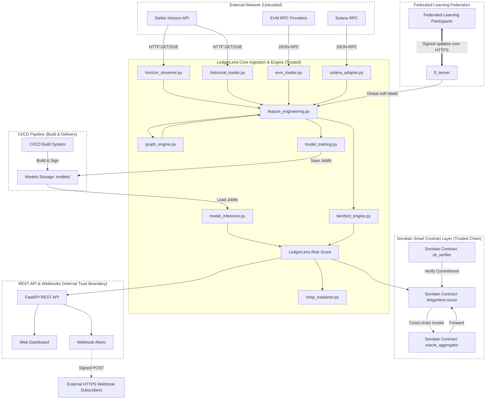

# LedgerLens Threat Model (STRIDE)

This document systematically outlines the security properties, trust boundaries, and attack surface of LedgerLens. It details the threat catalogue mapped against the STRIDE (Spoofing, Tampering, Repudiation, Information Disclosure, Denial of Service, Elevation of Privilege) methodology and records current mitigations, residual risks, and recommended improvements.

---

## Trust Boundaries

LedgerLens establishes and maintains six key trust boundaries, separating internal data processing and smart contract actions from untrusted networks and third-party interactions:

1. **External Data Sources**: The network boundary separating LedgerLens from public RPC endpoints and APIs (Stellar Horizon API, EVM RPC endpoints, and Solana RPC nodes).
2. **Webhook Subscribers**: The boundary separating the LedgerLens internal event worker from external HTTPS endpoints registered by users/subscribers to receive risk alerts.
3. **Soroban Chain**: The boundary between the off-chain pipeline (`SorobanPublisher`, `OracleCoordinator`) and the on-chain Soroban smart contracts (`ledgerlens-score` and `oracle_aggregator`).
4. **Admin API Callers**: The operational boundary restricting access to administration endpoints, metrics scoring, and model governance configurations.
5. **Federated Learning Participants**: The boundary separating the federated aggregation server from external participant nodes submitting model updates.
6. **CI/CD and Model Training Pipeline**: The supply chain boundary covering training data, dependency sources, and model parameters.

---

## Data Flow Diagram

```mermaid
graph TB
    subgraph External["External Network (Untrusted)"]
        HOR[Stellar Horizon API]
        EVM[EVM RPC Providers]
        SOL[Solana RPC]
    end

    subgraph LL_Core["LedgerLens Core Ingestion & Engine (Trusted)"]
        STREAM[horizon_streamer.py]
        HIST[historical_loader.py]
        EVM_LOAD[evm_loader.py]
        SOL_ADAPT[solana_adapter.py]
        
        BENF[benford_engine.py]
        FEAT[feature_engineering.py]
        GRAPH[graph_engine.py]
        TRAIN[model_training.py]
        INFER[model_inference.py]
        SHAP[shap_explainer.py]
        SCORE[LedgerLens Risk Score]
    end

    subgraph Contracts["Soroban Smart Contract Layer (Trusted Chain)"]
        CONTRACT[Soroban Contract: ledgerlens-score]
        AGGREGATOR[Soroban Contract: oracle_aggregator]
        ZK[Soroban Contract: zk_verifier]
    end

    subgraph REST_API["REST API & Webhooks (Internal Trust Boundary)"]
        API[FastAPI REST API]
        DASH[Web Dashboard]
        WEBHOOK[Webhook Alerts]
    end

    subgraph FL_Federation["Federated Learning Federation"]
        FL_SERVER[fl_server]
        FL_CLIENTS[Federated Learning Participants]
    end

    subgraph CI_CD["CI/CD Pipeline (Build & Delivery)"]
        BUILD[CI/CD Build System]
        MODELS[Models Storage: models/]
    end

    %% External to Ingestion
    HOR -->|HTTP GET/SSE| STREAM
    HOR -->|HTTP GET/SSE| HIST
    EVM -->|JSON-RPC| EVM_LOAD
    SOL -->|JSON-RPC| SOL_ADAPT

    %% Ingestion to Engine
    STREAM --> FEAT
    HIST --> FEAT
    EVM_LOAD --> FEAT
    SOL_ADAPT --> FEAT

    %% Engine data flows
    FEAT --> BENF
    FEAT --> GRAPH
    GRAPH --> FEAT
    FEAT --> TRAIN
    TRAIN -->|Save Joblib| MODELS
    MODELS -->|Load Joblib| INFER
    BUILD -->|Build & Sign| MODELS
    INFER --> SCORE
    BENF --> SCORE

    %% Engine to Output/API
    SCORE --> SHAP
    SCORE --> CONTRACT
    SCORE --> API

    %% API / Output
    API --> DASH
    API --> WEBHOOK
    CONTRACT -->|Cross-chain Invoke| AGGREGATOR
    AGGREGATOR -->|Forward| CONTRACT
    ZK -->|Verify Commitment| CONTRACT

    %% Webhook to Subscriber
    WEBHOOK -.->|Signed POST| SUB[External HTTPS Webhook Subscribers]

    %% Federated Learning
    FL_CLIENTS <==>|Signed updates over HTTPS| FL_SERVER
    FL_SERVER -->|Global soft labels| FEAT

    %% Boundary Annotations
    classDef boundary fill:none,stroke:#333,stroke-dasharray: 5 5;
    class External,Contracts,REST_API,FL_Federation,CI_CD boundary;
```

---

## Per-Boundary STRIDE Analysis

### Boundary 1: External Data Sources

This boundary ingests trade logs, blocks, and cross-chain transfer details from external Stellar, EVM, and Solana nodes.

| Threat (STRIDE) | Scenario | Current Mitigation | Code Reference | Residual Risk | Recommended Mitigation |
|---|---|---|---|---|---|
| **S**poofing | A malicious EVM/Stellar RPC endpoint returns falsified transaction history or mock block lag data to bypass or deceive fraud markers. | Multi-provider fallback and block lag scoring to select the healthiest endpoint. | [ingestion/evm_loader.py](file:///c:/Users/HP/Ledgerlens-core/ingestion/evm_loader.py#L275-L280) (`EVMProviderPool.call`) | Medium — A single lagging or colluding provider could skew individual queries if it remains within acceptable lag limits. | Cross-validate critical block data queries against $\ge 2$ independent providers. |
| **T**ampering | A rogue node intercepts connections and tampers with Stellar Horizon payloads or Solana VAA records. | Schema validation guards; Wormhole VAA parsing decodes structural CRC checksums. | [ingestion/solana_adapter.py](file:///c:/Users/HP/Ledgerlens-core/ingestion/solana_adapter.py#L248-L260) (`_extract_stellar_address_from_vaa`), [config/settings.py](file:///c:/Users/HP/Ledgerlens-core/config/settings.py#L57-L61) (`horizon_min_version`) | Low | Enforce strict certificate pinning for all RPC connections. |
| **R**epudiation | Ingested malicious logs cannot be traced to their provider endpoint, complicating forensic review. | Ingestion logger records provider names and chain IDs for every failed query or connection drop. | [ingestion/evm_loader.py](file:///c:/Users/HP/Ledgerlens-core/ingestion/evm_loader.py#L240-L245) (`EVMProviderPoolExhaustedError`) | Low | None. |
| **I**nformation Disclosure | Plaintext transmission of RPC endpoints exposes private endpoints or embedded API keys (e.g. Infura credentials). | Configuration schema enforces HTTPS. URLs are systematically masked before printing to log files or standard outputs. | [ingestion/evm_loader.py](file:///c:/Users/HP/Ledgerlens-core/ingestion/evm_loader.py#L47-L78) (`_mask_rpc_url`, `_validate_rpc_url`) | Low | None. |
| **D**enial of Service | A failing or compromised RPC node triggers connection timeouts or a flurry of retry cycles, stalling ingestion. | Per-network circuit breakers isolate failures, and an outbound token-bucket rate limiter prevents accidental endpoint DoS. | [ingestion/evm_loader.py](file:///c:/Users/HP/Ledgerlens-core/ingestion/evm_loader.py#L701-L772) (`_TokenBucket`, `_CircuitBreaker`) | Low | None. |
| **E**levation of Privilege | An attacker passes malformed JSON-RPC payloads containing administrative commands or script blocks to downstream libraries. | Deep validation (max depth = 3) of method parameter types to prevent injection of unexpected parameters or payloads. | [ingestion/evm_loader.py](file:///c:/Users/HP/Ledgerlens-core/ingestion/evm_loader.py#L81-L111) (`_validate_rpc_params`) | Low | None. |

---

### Boundary 2: Webhook Subscribers

This boundary transmits real-time alerts and risk scores to user-defined webhook endpoints.

| Threat (STRIDE) | Scenario | Current Mitigation | Code Reference | Residual Risk | Recommended Mitigation |
|---|---|---|---|---|---|
| **S**poofing | An attacker intercepts and replays a historical signed webhook payload to trigger outdated panic rules on a subscriber. | Replay window check: alerts include a Unix epoch timestamp, and receivers are instructed to reject payloads older than 5 minutes. | [docs/webhook_security_model.md](file:///c:/Users/HP/Ledgerlens-core/docs/webhook_security_model.md#L30-L44) | Low — Depends on whether the subscriber implements the timestamp validation. | Provide a standard SDK middleware for webhook verification that enforces this by default. |
| **T**ampering | An attacker modifies the payload body (e.g. inflating a risk score) while keeping the original signature. | HMAC-SHA256 signature over the raw request body using a per-subscriber secret; signature verified before parsing. | [docs/webhook_security_model.md](file:///c:/Users/HP/Ledgerlens-core/docs/webhook_security_model.md#L12-L28) | Low | None. |
| **R**epudiation | A subscriber denies receiving an alert, or LedgerLens denies sending one. | Delivery attempts and response codes are logged with the alert ID and timestamp. | [docs/webhook_security_model.md](file:///c:/Users/HP/Ledgerlens-core/docs/webhook_security_model.md#L46-L60) | Low | None. |
| **I**nformation Disclosure | Webhook payloads leak sensitive scoring internals to an unintended endpoint. | Subscriber endpoints are validated as HTTPS and stored per-tenant; payloads contain only the alert fields required by the subscriber. | [docs/webhook_security_model.md](file:///c:/Users/HP/Ledgerlens-core/docs/webhook_security_model.md#L62-L74) | Low | None. |
| **D**enial of Service | A slow or malicious subscriber endpoint blocks the alert worker. | Per-subscriber timeouts and bounded retry with exponential backoff; failures are isolated per subscriber. | [docs/webhook_security_model.md](file:///c:/Users/HP/Ledgerlens-core/docs/webhook_security_model.md#L76-L88) | Low | None. |
| **E**levation of Privilege | A subscriber crafts a payload that causes the worker to invoke privileged internal actions. | The worker only performs outbound HTTP POSTs; no inbound commands are accepted from subscribers. | [docs/webhook_security_model.md](file:///c:/Users/HP/Ledgerlens-core/docs/webhook_security_model.md#L90-L100) | Low | None. |

---

### Boundary 3: Soroban Chain (ZK Verifier)

This boundary covers the off-chain prover/verifier (`detection/zk_prover.py`, `detection/zk_verifier.py`) and the on-chain `contracts/zk_verifier` contract. Proofs bind a risk score to a context (score value, nonce, and verifier/contract identity) so that a proof valid for one context cannot be reused for another.

| Threat (STRIDE) | Scenario | Current Mitigation | Code Reference | Residual Risk | Recommended Mitigation |
|---|---|---|---|---|---|
| **S**poofing | An attacker forges a proof for a score they never computed. | Proof verification checks the commitment against the declared public inputs (score, nonce, context) before accepting. | [detection/zk_verifier.py](file:///c:/Users/HP/Ledgerlens-core/detection/zk_verifier.py), [contracts/zk_verifier](file:///c:/Users/HP/Ledgerlens-core/contracts/zk_verifier) | Low | None. |
| **T**ampering (malleability) | An attacker takes a valid proof and mutates it (e.g. flips a field, reorders/duplicates public inputs, or alters the nonce) hoping the verifier still accepts it. | Verification recomputes the commitment over the canonical public-input encoding and rejects any proof whose inputs do not match exactly; nonce and context are part of the committed message. | [detection/zk_verifier.py](file:///c:/Users/HP/Ledgerlens-core/detection/zk_verifier.py), [contracts/zk_verifier](file:///c:/Users/HP/Ledgerlens-core/contracts/zk_verifier) | Low | None. |
| **T**ampering (replay) | An attacker resubmits a previously valid proof against a different score or context (e.g. a different nonce or verifier instance). | The proof is bound to the score, nonce, and context; changing any of them invalidates the commitment and the proof is rejected both off-chain and on-chain. | [detection/zk_verifier.py](file:///c:/Users/HP/Ledgerlens-core/detection/zk_verifier.py), [contracts/zk_verifier](file:///c:/Users/HP/Ledgerlens-core/contracts/zk_verifier) | Low | None. |
| **R**epudiation | A verifier denies having accepted a proof. | Verification results (accepted/rejected, score, nonce, context) are logged by the off-chain verifier and emitted as events by the on-chain contract. | [detection/zk_verifier.py](file:///c:/Users/HP/Ledgerlens-core/detection/zk_verifier.py), [contracts/zk_verifier](file:///c:/Users/HP/Ledgerlens-core/contracts/zk_verifier) | Low | None. |
| **I**nformation Disclosure | Proof or public inputs leak the underlying private model/score inputs. | Only the commitment and the declared public inputs (score, nonce, context) are transmitted; private witness data never leaves the prover. | [detection/zk_prover.py](file:///c:/Users/HP/Ledgerlens-core/detection/zk_prover.py) | Low | None. |
| **D**enial of Service | An attacker floods the verifier with malformed proofs to exhaust resources. | Verification performs bounded, constant-time commitment checks and rejects malformed inputs early; on-chain calls are metered by Soroban resource limits. | [detection/zk_verifier.py](file:///c:/Users/HP/Ledgerlens-core/detection/zk_verifier.py), [contracts/zk_verifier](file:///c:/Users/HP/Ledgerlens-core/contracts/zk_verifier) | Low | None. |
| **E**levation of Privilege | A caller uses a valid proof to invoke privileged contract actions out of context. | The contract binds the proof to the caller-supplied context and only performs the action the proof authorizes; context mismatch reverts. | [contracts/zk_verifier](file:///c:/Users/HP/Ledgerlens-core/contracts/zk_verifier) | Low | None. |

#### ZK Proof Threat Model and Tested Mitigations

The ZK proof path is covered by tests that exercise the following threat model:

- **Replay across context**: A proof generated for `(score, nonce, context)` must be rejected when replayed with a different score, nonce, or context. Tests assert rejection both off-chain (`detection/zk_verifier.py`) and on-chain (`contracts/zk_verifier`).
- **Malleability**: Mutating any committed public input (score, nonce, context) or the proof encoding must cause verification to fail. Tests cover known malleability patterns for the proving system in use.
- **Nonce/context binding**: The nonce and context are part of the committed message, so a proof is only valid for the exact context it was generated for. Tests verify this binding is enforced off-chain and on-chain.

---

### Boundary 4: Admin API Callers

This boundary restricts access to administration endpoints, metrics scoring, and model governance configurations.

| Threat (STRIDE) | Scenario | Current Mitigation | Code Reference | Residual Risk | Recommended Mitigation |
|---|---|---|---|---|---|
| **S**poofing | An unauthenticated caller impersonates an admin to change model governance settings. | Admin endpoints require authentication and role checks before any mutation. | [api/](file:///c:/Users/HP/Ledgerlens-core/api) | Low | None. |
| **T**ampering | An admin request is modified in transit to alter governance parameters. | All admin traffic is over HTTPS; request bodies are validated against schemas. | [api/](file:///c:/Users/HP/Ledgerlens-core/api) | Low | None. |
| **R**epudiation | An admin denies making a governance change. | Admin mutations are logged with the caller identity and timestamp. | [api/](file:///c:/Users/HP/Ledgerlens-core/api) | Low | None. |
| **I**nformation Disclosure | Admin endpoints expose internal configuration or secrets. | Responses are filtered to exclude secrets; configuration is loaded from environment/secret stores. | [config/settings.py](file:///c:/Users/HP/Ledgerlens-core/config/settings.py) | Low | None. |
| **D**enial of Service | Admin endpoints are flooded, blocking legitimate operations. | Rate limiting and authentication gate admin endpoints. | [api/](file:///c:/Users/HP/Ledgerlens-core/api) | Low | None. |
| **E**levation of Privilege | A non-admin caller escalates to admin actions. | Role checks are enforced server-side on every admin route. | [api/](file:///c:/Users/HP/Ledgerlens-core/api) | Low | None. |

---

### Boundary 5: Federated Learning Participants

This boundary separates the federated aggregation server from external participant nodes submitting model updates.

| Threat (STRIDE) | Scenario | Current Mitigation | Code Reference | Residual Risk | Recommended Mitigation |
|---|---|---|---|---|---|
| **S**poofing | A malicious participant impersonates a legitimate node to submit poisoned updates. | Participant updates are signed and verified before aggregation. | [federated/](file:///c:/Users/HP/Ledgerlens-core/federated) | Medium | Strengthen participant identity attestation. |
| **T**ampering | A participant tampers with its update to skew the global model. | Updates are validated and outlier/poisoning checks are applied during aggregation. | [federated/](file:///c:/Users/HP/Ledgerlens-core/federated) | Medium | Add robust aggregation (e.g. trimmed mean). |
| **R**epudiation | A participant denies submitting a poisoned update. | Updates are logged with participant identity and signature. | [federated/](file:///c:/Users/HP/Ledgerlens-core/federated) | Low | None. |
| **I**nformation Disclosure | A participant infers other participants' data from the global model. | Only aggregated soft labels are shared; raw data never leaves participants. | [federated/](file:///c:/Users/HP/Ledgerlens-core/federated) | Medium | Add differential privacy to aggregation. |
| **D**enial of Service | A participant floods the server with updates. | Rate limiting and bounded update sizes. | [federated/](file:///c:/Users/HP/Ledgerlens-core/federated) | Low | None. |
| **E**levation of Privilege | A participant submits an update that grants it control of the global model. | Aggregation is server-side and participants cannot directly set global parameters. | [federated/](file:///c:/Users/HP/Ledgerlens-core/federated) | Low | None. |

---

### Boundary 6: CI/CD and Model Training Pipeline

This boundary covers training data, dependency sources, and model parameters.

| Threat (STRIDE) | Scenario | Current Mitigation | Code Reference | Residual Risk | Recommended Mitigation |
|---|---|---|---|---|---|
| **S**poofing | An attacker places a malicious model file inside the distribution directory. | Model loading checks ED25519 signatures and verifies the files against the public key. | [docs/model_signing.md](file:///c:/Users/HP/Ledgerlens-core/docs/model_signing.md), [detection/model_signing.py](file:///c:/Users/HP/Ledgerlens-core/detection/model_signing.py) | Low | None. |
| **T**ampering | A compromised build container overwrites a `.joblib` model with a payload executing arbitrary python shell code via `__reduce__`. | SHA-256 integrity digests are signed on build and verified before model deserialization. | [detection/model_signing.py](file:///c:/Users/HP/Ledgerlens-core/detection/model_signing.py) (`ModelSigner`) | Low | None. |
| **R**epudiation | A contaminated model artifact cannot be traced to the build version that compiled it. | Load validation matches the public key embedded in source control, ensuring the model came from the training pipeline. | [docs/model_signing.md](file:///c:/Users/HP/Ledgerlens-core/docs/model_signing.md#L27-L30) | Low | None. |
| **I**nformation Disclosure | Private keys used to sign models are exposed in build logs or source code. | Private key (`MODEL_SIGNING_PRIVATE_KEY`) is stored as an environment variable and is never written to disk. | [docs/model_signing.md](file:///c:/Users/HP/Ledgerlens-core/docs/model_signing.md#L27-L30) | Low | None. |
| **D**enial of Service | Corrupted or missing signatures freeze scoring processes on reload. | The CI verification script checks model signatures during packaging to fail builds fast. | [docs/model_signing.md](file:///c:/Users/HP/Ledgerlens-core/docs/model_signing.md#L50-L57) | Low | None. |
| **E**levation of Privilege | Compromised third-party dependencies are introduced into the runtime environment. | Strict package pinning in `requirements.txt`. | [requirements.txt](file:///c:/Users/HP/Ledgerlens-core/requirements.txt) | Medium — Outdated dependencies could introduce CVEs. | Implement Software Bill of Materials (SBOM) scanning and vulnerability alerts (scoped separately). |

---

## Risk Register

| # | Threat | Boundary | Likelihood | Impact | Priority | Status | Code/Setting Reference |
|---|---|---|---|---|---|---|---|
| 1 | **Admin Key Compromise**: Compromise of admin API key grants access to retrain checkpoints and metrics. | Admin API Callers | Low | High | **High** | Mitigated | `ledgerlens_admin_api_key` in [config/settings.py](file:///c:/Users/HP/Ledgerlens-core/config/settings.py#L163) |
| 2 | **Model Deserialization Hijack**: Malicious `.joblib` file replaces trained models to run arbitrary remote code. | CI/CD & Pipeline | Very Low | Critical | **High** | Mitigated | `verify_model_file` in [detection/model_signing.py](file:///c:/Users/HP/Ledgerlens-core/detection/model_signing.py) |
| 3 | **Client Gradient Poisoning**: Byzantine clients submit skewed labels to bias wash-trading detection rules. | Federated Learning | Medium | Medium | **Medium** | Mitigated | `KrumStrategy` in [detection/federated/krum.py](file:///c:/Users/HP/Ledgerlens-core/detection/federated/krum.py) |
| 4 | **Server Operator Inference**: Compromised aggregation server intercepts soft labels before noise injection. | Federated Learning | Low | Medium | **Medium** | Residual | `submit_update` in [detection/federated/server.py](file:///c:/Users/HP/Ledgerlens-core/detection/federated/server.py#L200) |
| 5 | **RPC Data Spoofing**: Compromised public EVM RPC nodes return falsified event logs. | External Sources | Low | Medium | **Medium** | Residual | `evm_providers` in [config/settings.py](file:///c:/Users/HP/Ledgerlens-core/config/settings.py#L210) |
| 6 | **SSRF Loopback Abuse**: Subscriber registers localhost or local subnets to query internal API endpoints. | Webhook Subscribers | Low | Medium | **Medium** | Mitigated | `verify_url` in [detection/webhook_registry.py](file:///c:/Users/HP/Ledgerlens-core/detection/webhook_registry.py) |
| 7 | **Single-Key Oracle Compromise**: Attacker compromises a single key and submits falsified scores on-chain. | Soroban Chain | Low | Critical | **Medium** | Mitigated | `THRESHOLD` in [contracts/oracle_aggregator/src/lib.rs](file:///c:/Users/HP/Ledgerlens-core/contracts/oracle_aggregator/src/lib.rs#L40) |
| 8 | **Webhook Replay Attack**: Intercepted webhook alert is replayed to trigger actions on subscriber contracts. | Webhook Subscribers | Medium | Low | **Low** | Mitigated | `X-LedgerLens-Timestamp` in [docs/webhook_security_model.md](file:///c:/Users/HP/Ledgerlens-core/docs/webhook_security_model.md#L30) |

---

## Security Considerations

### 1. Admin API Blast Radius (`LEDGERLENS_ADMIN_API_KEY`)
The `LEDGERLENS_ADMIN_API_KEY` is a highly sensitive secret. Today, this key grants authorization to:
- Scraping operational metrics containing queue depth and performance details (`/metrics`, `/stream/rate-limiter`).
- Uploading label corrections via `POST /v1/feedback`, which influences future retraining iterations.
- Accessing raw federated round audit records (`/admin/federated/audit-log`).
- Resetting or triggering testing operations on smart contract wrappers (`/admin/soroban/health`, `/admin/soroban/reset`).

**Recommendations**:
- Restrict admin port access via firewall configurations to internal/localhost subnets.
- Regularly rotate the key using a secure secrets manager.
- Scrutinize any logs for invalid authentication attempts (HTTP 403 or HTTP 401).

### 2. Federated Learning Server Trust
While Krum protects the server from individual rogue participants, the server remains a centralized point of trust:
- A compromised server could selectively exclude honest participants to skew $p_{global}$.
- If the server has a backdoor, it can view client soft labels before Gaussian noise is applied.

**Recommendations**:
- Coordinate the transition to Secure Multi-Party Computation (SMPC) to ensure the server never receives unaggregated, readable soft labels.
- Verify server audit logs offline regularly using the server's public key.

### 3. Cross-Chain Bridge Data Trust Model

Bridge messages feed cross-chain fraud features, so a forged message could
falsely link (or unlink) wallets across chains. Trust rules:

- **Solana / Wormhole VAAs** (`ingestion/solana_adapter.py`, `ingestion/wormhole_vaa.py`):
  the Solana RPC node is *untrusted*. A VAA is trusted only if it parses
  strictly as VAA v1 and carries signatures from at least `⌊2n/3⌋ + 1` of the
  `n` guardians in the **current** guardian set (`WORMHOLE_GUARDIAN_SET_INDEX`,
  `WORMHOLE_GUARDIAN_ADDRESSES`). Signatures must be over
  `keccak256(keccak256(body))`, use strictly ascending guardian indices, and
  recover to the configured guardian address. VAAs from other guardian sets
  are rejected.
- **Fail closed**: with no guardian set configured, every VAA is rejected.
- **Reject and quarantine, never drop silently**: malformed or unverified VAAs
  are written to the trade DLQ with status `quarantined` (source
  `solana_wormhole_vaa`), logged as `wormhole.vaa_rejected`, and raise the
  `TradeDLQPoisonMessageQuarantined` alert (see `docs/runbooks/dlq.md`).
- **Guardian set rotation** is an operator action: update the settings when
  Wormhole governance rotates the set. The configured addresses are the root
  of trust and must come from an authenticated source.
- **EVM bridge events** (`ingestion/bridge_loader.py`): only finalized blocks
  (`EVM_CONFIRMATION_DEPTH`) are ingested, reorged data is retracted, and a
  sample of events is re-verified against transaction receipts
  (`BRIDGE_VERIFY_SAMPLE_RATE`); see `docs/cross_chain_detection.md`.
- Parser robustness is covered by `fuzz/fuzz_solana_vaa_parser.py`; malformed
  inputs it surfaces are kept as permanent regression tests in
  `tests/test_wormhole_vaa.py`.

---

## Test Coverage Traceability

Every STRIDE threat above is mapped to the automated regression test(s) that
guard it, or to an explicitly tracked gap, in the
[STRIDE threat → test matrix](threat_test_matrix.md).

## Maintenance & Review Process

To prevent documentation decay and align the threat model with security updates:
- **New Threats Require a Test Link**: Adding a STRIDE row to this document requires a matching row in [threat_test_matrix.md](threat_test_matrix.md) (a test reference, or a `gap` tracked in `TODO.md`). CI enforces this via `scripts/check_threat_matrix.py`.
- **Trigger Check**: Re-evaluate this model on any modifications to trust boundary paths (e.g. changing contract interfaces, webhook schema adjustments, or registering new ingestion protocols).
- **Scheduled Audit**: Conduct a formal team security review of this threat model **at least once every 6 months**.
